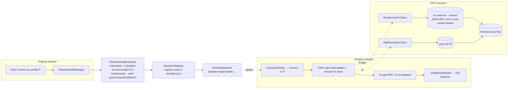

# Remote SSH for Obsidian

> **Edit an Obsidian vault that lives on a remote server — over plain SSH.**
> Think of VS Code's Remote-SSH, but for Obsidian: open a vault that sits on
> your home server, VPS, work box, or cluster, and edit it from a real
> Obsidian window. Files, attachments, search, and live updates — all served
> straight from the remote, over your own SSH connection.
>
> **No cloud. No sync service. No full copy left on your laptop.** Your notes
> stay on the machine you control; this one only ever holds what you're
> actively looking at.


<sub>End-to-end demo, recorded in CI by <a href=".github/workflows/demo-capture.yml"><code>demo-capture.yml</code></a> — connect to a remote host and edit its vault from a normal Obsidian window.</sub>

---

## Install

**Obsidian → Settings → Community plugins → Browse → search "Remote SSH" → Install → Enable.**

That's the whole install. The first time you connect with the (recommended)
RPC transport, the plugin fetches the matching helper daemon from its
signed GitHub release — with a one-time confirmation, verified by sha256 —
and uploads it to your host for you. Prefer no remote-side binary? Stay on
the **SFTP** transport and skip the daemon entirely.

<details>
<summary>Other install methods (BRAT for pre-release builds · manual)</summary>

### BRAT (early/beta builds)

[BRAT](https://github.com/TfTHacker/obsidian42-brat) auto-installs and
auto-updates pre-release builds straight from this repo:

1. Install **Obsidian42 - BRAT** from Community plugins → Browse.
2. BRAT settings → **Add Beta plugin** → paste `sotashimozono/obsidian-remote-ssh` → leave version blank.
3. Toggle **Remote SSH** on under Community plugins.

### Manual

Download `main.js`, `manifest.json`, and `styles.css` from the
[Releases page](https://github.com/sotashimozono/obsidian-remote-ssh/releases),
drop them into `<your-vault>/.obsidian/plugins/remote-ssh/`, and enable the
plugin. (The daemon still auto-downloads on first RPC connect; for an
air-gapped remote, grab the matching `obsidian-remote-server-<os>-<arch>`
binary from the same release and place it in `…/remote-ssh/server-bin/`.)

</details>

---

## Why you'd want this

You already keep your notes — or your code, or your research — on a machine
that isn't this one. A home server. A cloud VPS. The lab cluster. You SSH in
all the time. You'd love to use Obsidian on those files **without** copying
the whole vault down to every laptop and phone, and without handing it to a
sync provider.

That's the entire point of this plugin:

- 🔑 **Plain SSH, your keys, your config.** Password, private key, SSH agent,
  or a `ProxyJump` bastion — all read from the same `~/.ssh/config` your
  terminal already uses. No account to create, no third-party server to trust.
- ☁️ **No cloud middleman.** Files move directly between this machine and your
  host over the encrypted SSH tunnel. Nobody else ever holds your notes — and
  there's **no telemetry or analytics**; nothing leaves your machine except to
  the host you typed into a profile.
- 💻 **No full local replica.** Sync tools mirror your *entire* vault onto
  every device. This doesn't: the vault stays on the server, and your laptop
  only fetches the files you actually open (cached locally while you work, not
  a synced second copy of everything).
- 🧩 **It's still Obsidian.** The remote vault opens in a normal Obsidian
  window — real File Explorer, search, command palette, and most of the
  plugins you already use (Dataview, Templater, Excalidraw, Tasks, …).

---

## What you can do with it

- **Edit a remote vault as if it were local.** SSH into your server; the vault
  stays there, you get the full Obsidian editing experience here. No manual
  `rsync`, no Dropbox dance.
- **Keep huge vaults where they belong.** A 50k-file research vault or a
  media-heavy attachment vault doesn't need to land on every device — only the
  files you open are fetched.
- **Let the server stay the source of truth.** Cron jobs, scripts, an LLM
  pipeline, or your own `git` can keep operating on the canonical files; you're
  editing the *same* files, not a copy that races those writers.
- **Work from several machines.** Live updates push between connected clients
  via `fs.watch`; if two saves collide, a 3-way merge UI (ancestor / mine /
  theirs) opens instead of silently clobbering.
- **Survive flaky networks.** Disconnects spool your writes to an offline
  queue and drain them on reconnect; the status bar shows the pending count.
- **Use a remote-side terminal.** An integrated terminal pane runs on the
  remote, right next to the notes it's about.

### Good fits

- A **homelab / VPS** where your notes already live, and you want them to stay
  there.
- A **research / work cluster** (e.g. an HPC login node) holding data and notes
  you SSH into anyway.
- Vaults that are **too large or too private** to replicate everywhere or to
  hand to a managed sync service — for legal, privacy, or compliance reasons.

---

## Quickstart

About **3 minutes** if you already have an SSH host.

1. **Add a profile.** Settings → Remote SSH → **+ Add**. Enter host, port,
   username, auth method (`privateKey` / `password` / `agent`), transport
   (`RPC` recommended), and the **remote vault path** (relative paths resolve
   under `$HOME` — `notes/main` → `~/notes/main`).
2. **Click Connect** on the profile row, or run **Remote SSH: Connect to
   remote vault** from the command palette.
3. **A new Obsidian window opens** — your "shadow vault". Same UI you know,
   but every file in it lives on the remote. Start editing.

To leave: close the shadow window, or run **Remote SSH: Disconnect** inside
it. Your original window is never touched.

> **First time connecting a brand-new profile?** Obsidian only learns about
> the new vault at startup, so the very first connect may need one **restart**
> of Obsidian before the window appears — then reconnect. It's a one-time step
> per profile; every later connect opens immediately.

---

## Features

| Feature | Notes |
| --- | --- |
| 🪟 **Opens in its own Obsidian window** | The window you started from is untouched; the remote vault is a first-class window with its own File Explorer, search, and command palette. |
| ⚡ **Sub-second cold-open, even for 10k-file vaults** | A single `fs.walk` RPC fetches the whole tree in one round-trip (per-folder `fs.list` fallback for SFTP). |
| 🖼️ **Image / PDF / video rendering** | A local-only HTTP bridge (random localhost port + bearer token) streams binary content to the Obsidian webview; images go through a `fs.thumbnail` cache (RPC transport). |
| 🔁 **Live multi-client sync** | `fs.watch` notifies every connected client when another writer changes a file; explorer + open editors update within ~1 s. |
| 🪢 **3-way conflict resolution** | If the remote file moved under your edit, a merge modal opens with ancestor / mine / theirs panes (plain text; binaries fall back to a 2-choice modal). |
| 📥 **Offline write queue** | Writes during a disconnect spool to a local queue and drain automatically on reconnect; the status bar shows the pending count. |
| 🩹 **Automatic reconnect with backoff** | SSH drops trigger a retry loop (default 5, exponential backoff to 30 s); reads come from cache during retries, writes spool to the queue. |
| 🔌 **Jump host / `ProxyJump`** | Multi-hop SSH through bastions, from the same `~/.ssh/config` your terminal uses. |
| 🔐 **Signed daemon binaries** | Every release daemon is Sigstore-cosign-signed; the plugin also runs a sha256 round-trip check on every deploy and refuses a mismatch. |

---

## How it compares (the short version)

Most "edit my vault from anywhere" options **copy** the vault around —
Obsidian Sync (managed, encrypted, on Obsidian's servers), file-sync tools
(Syncthing / Dropbox / iCloud), or `obsidian-git` (a git repo you pull/push).
Each is great when replicating the vault is what you actually want.

**This plugin is for the opposite case:** the vault should live *only* on a
remote host you control, with no second copy and no third party — and you
want to edit it in place. If that's your situation, this is the niche it's
built for; if not, one of the above is simpler.

Full breakdown (when to pick which):
[docs → comparison](http://codes.sota-shimozono.com/obsidian-remote-ssh/en/comparison/).

---

## What stays on your computer

By design, the canonical vault never leaves your SSH host. On the local side:

| Capability | Why it's needed | Scope |
|---|---|---|
| **Network** | The SSH/SFTP connection | Only the host / port / optional jump host in your profile |
| **Filesystem (outside the vault)** | Read your SSH key + `~/.ssh/config` to authenticate; cache the daemon binary | `~/.ssh/*` and the plugin's own `server-bin/` cache only |
| **System identity** | Sensible defaults for the client id + remote username | `os.hostname()` / `os.userInfo().username` (both overridable); `SSH_AUTH_SOCK` etc. to find your agent/config |
| **Process execution** | Start the daemon on the **remote** over SSH | Remote host only — no local shell execution |
| **Clipboard (write)** | The "Copy diagnostics" button | Only on explicit click; the clipboard is never read |

**No telemetry, no analytics.** Locally you keep only a working cache of the
files you've opened — never a full replica of the vault.

---

## Security

Daemon binaries are signed with [Sigstore cosign](https://www.sigstore.dev/)
(keyless OIDC); verify any release binary yourself with the one-line
`cosign verify-blob` in [SECURITY.md](SECURITY.md#verifying-release-artefacts).
On every deploy the plugin re-checks the uploaded binary by sha256 and refuses
to start a mismatch.

To **report a vulnerability**, use a private GitHub Security Advisory — policy
in [SECURITY.md](SECURITY.md). Please don't open a public issue for security
bugs.

---

## Plugin compatibility

The shadow vault patches `app.vault.adapter`, so plugins that go through
Obsidian's vault API work transparently — Dataview, Templater, Daily Notes,
Tasks, Calendar, Excalidraw (RPC transport), and most others. Plugins that
**bypass** the adapter (importing Node `fs` directly, e.g. Omnisearch's
indexer) see an empty local directory instead of your remote vault.

Full matrix:
[docs → plugin compatibility](http://codes.sota-shimozono.com/obsidian-remote-ssh/en/user-guide/plugin-compatibility/).

---

## Troubleshooting

The console log is the first thing to check (JSONL, one event per line):

```text
~/.obsidian-remote/vaults/<profile-id>/.obsidian/plugins/remote-ssh/console.log
```

```bash
jq 'select(.level == "error")' console.log    # just the errors
tail -20 console.log | jq -c '{ts, level, msg}'
```

A few common ones:

- **No new window opens after connecting a *new* profile** — Obsidian only
  registers new vaults at startup. Fully quit and reopen Obsidian, then
  Connect again (one-time per profile; tracked in
  [#411](https://github.com/sotashimozono/obsidian-remote-ssh/issues/411)).
- **Shadow window opens but File Explorer is empty** — the auto-connect
  failed. Check the shadow window's console log and run **Remote SSH:
  Reconnect** from the command palette.
- **Images / PDFs don't render** — those need the `RPC` transport; check the
  profile's transport setting.
- **Connect succeeds but the daemon won't come up** — the session falls back
  to SFTP (vault read/write still work; daemon-only features are off). See the
  daemon log: `ssh <host> 'cat ~/.obsidian-remote/server.log'`.

More: [docs → troubleshooting](http://codes.sota-shimozono.com/obsidian-remote-ssh/en/operations/troubleshooting/).

---

## How it works (technical)

Obsidian doesn't expose a public way to rebuild the vault model from a
different storage adapter mid-session, so the plugin opens a separate
**shadow window** whose vault is constructed from the remote tree at startup —
every plugin in that window sees a normal-looking vault from frame zero.



Two transports per profile:

- **`RPC` (recommended).** A small Go daemon (`obsidian-remote-server`) runs on
  the remote; the plugin auto-fetches the signed binary, uploads it, and starts
  it. Vault FS ops flow as length-framed JSON-RPC over a forwarded unix socket.
  Required for image/PDF/video rendering, sub-second cold-open, thumbnails, and
  live `fs.watch` updates.
- **`SFTP`.** Direct SFTP over `ssh2`, no remote-side install — loses the
  daemon-only features above.

Design deep-dives:
[shadow-vault architecture](http://codes.sota-shimozono.com/obsidian-remote-ssh/en/architecture/shadow-vault/) ·
[performance](http://codes.sota-shimozono.com/obsidian-remote-ssh/en/architecture/perf/) ·
[conflicts & offline queue](http://codes.sota-shimozono.com/obsidian-remote-ssh/en/architecture/collab/).

---

## Contributing

Contributions welcome — dev setup, branch + commit conventions, and how to run
the test suite are in [CONTRIBUTING.md](CONTRIBUTING.md). Bugs and feature
requests: [Issues](https://github.com/sotashimozono/obsidian-remote-ssh/issues).

Inspired by VS Code's Remote-SSH; the wire format is LSP-style framed JSON-RPC
over a unix-socket-forwarded stream — the same shape language servers use, just
for filesystem ops.

---

## Support

Remote SSH is, for now, maintained by a single individual. Sponsoring it helps
sustain the **continued maintenance and ongoing issue responses** over time,
which genuinely matters for a one-person project. Hugely appreciated 🙏

- ☕ [Buy Me a Coffee](https://www.buymeacoffee.com/sotashimozono)
- 💖 [GitHub Sponsors](https://github.com/sponsors/sotashimozono)

(A donate link also lives right in the plugin's settings page.)

---

## Project status

Released and available in the **Obsidian Community Plugins** store. Daemon
binaries are cosign-signed and end-to-end tested against Linux + macOS remotes.

[](https://github.com/sotashimozono/obsidian-remote-ssh/releases)
[](https://github.com/sotashimozono/obsidian-remote-ssh/releases)
[](http://codes.sota-shimozono.com/obsidian-remote-ssh/)
[](LICENSE)

<details>
<summary>Build · coverage · platform badges (for contributors)</summary>

[](https://github.com/sotashimozono/obsidian-remote-ssh/actions/workflows/ci.yml)
[](https://github.com/sotashimozono/obsidian-remote-ssh/actions/workflows/integration.yml)
[](https://github.com/sotashimozono/obsidian-remote-ssh/actions/workflows/security.yml)
[](https://codecov.io/gh/sotashimozono/obsidian-remote-ssh)
[](https://github.com/sotashimozono/obsidian-remote-ssh/actions/workflows/docs.yml)
[](http://codes.sota-shimozono.com/obsidian-remote-ssh/dev/)
[](https://obsidian.md)
[](https://go.dev)
[](https://nodejs.org)


</details>
