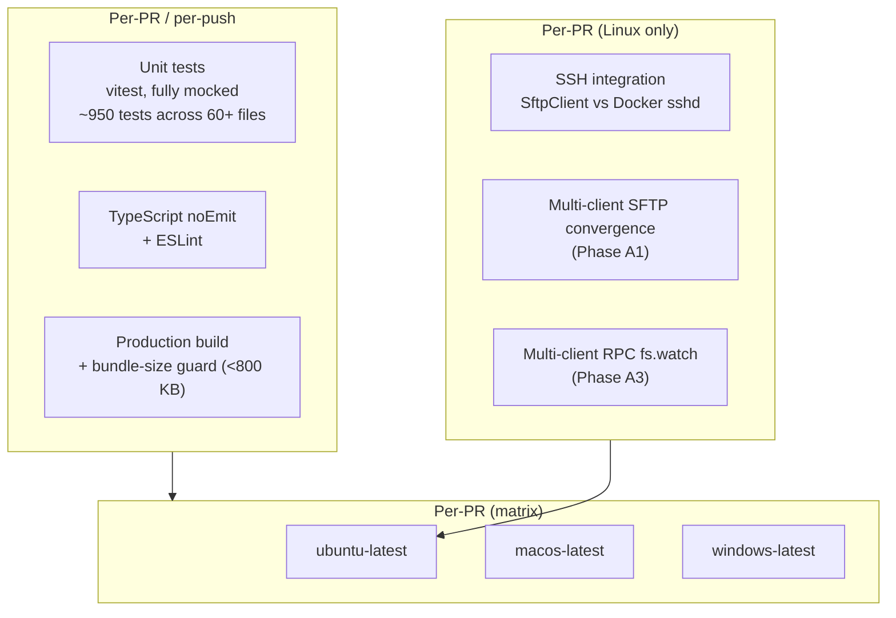
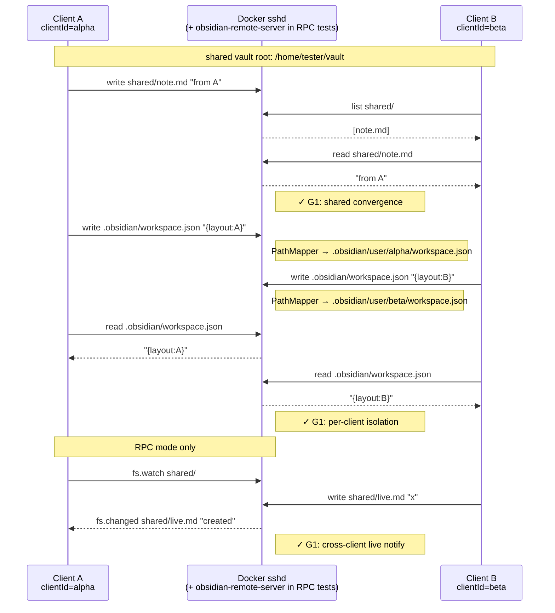
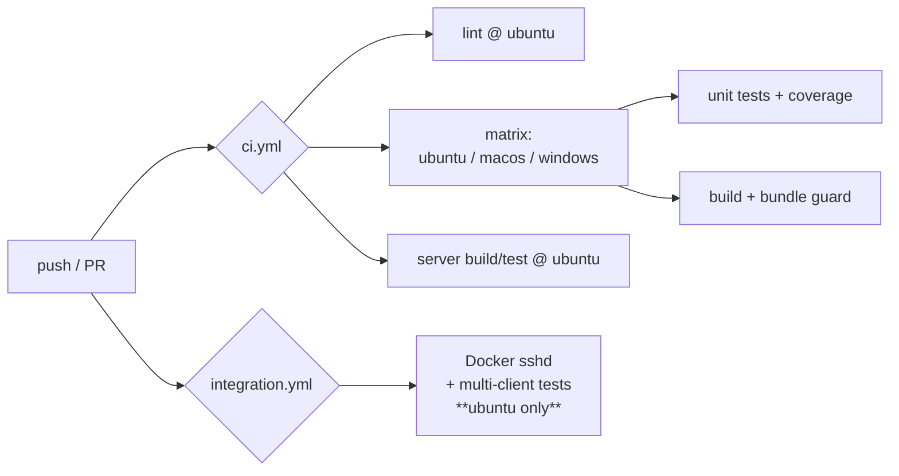

# Testing strategy

This document records the test architecture for `obsidian-remote-ssh`,
adopted in v0.4.19 (Phase A) and v0.4.22 (Phase B). It complements
[shadow-vault.md](../architecture/shadow-vault.md) — the
shadow-vault flow is what we test; this doc explains *how*.

## Goals

- **G1** — Two clients editing the same remote vault don't break each
  other: shared content converges, per-client UI state stays isolated.
- **G2** — The plugin builds and unit-tests pass on every desktop OS
  Obsidian itself ships on (Linux / macOS / Windows).

## Layers



`Local` runs on the matrix. `Container` runs only on `ubuntu-latest`
because Linux containers aren't available on macOS / Windows GitHub
runners.

## Test environments

The integration and E2E suites do not name a host. They ask
`plugin/test-env/target.ts`, and `ORSSH_TEST_ENV` picks between two
environments that serve the *same* sshd image with the *same* keypair:

| `ORSSH_TEST_ENV` | Compose file | How the suite reaches sshd |
|---|---|---|
| `local` (default) | `docker-compose.yml` | published on `127.0.0.1:2222` |
| `tailnet` | `docker-compose.tailnet.yml` | MagicDNS name over WireGuard, through a SOCKS5 `ProxyCommand` |

```bash
npm run tailnet:start            # ~15s cold: control plane, two nodes, sshd
npm run test:integration:tailnet
npm run test:e2e:tailnet
npm run tailnet:stop             # down -v; the tailnet is disposable
```

### Why a second environment

[`share-via-tailscale.md`](../cookbook/share-via-tailscale.md) tells users
to run their vault over Tailscale, on the argument that the plugin needs no
special handling because the host is just an SSH host on a different path.
That is a claim about every read, write, watch and reconnect in the suite —
not about one connection — so it is checked by running the suite over that
path rather than by adding a single Tailscale test.

### What it is made of

`headscale` is a self-hosted Tailscale control plane, so the tailnet is
built from two container images and nothing else: **no Tailscale account, no
auth key, no secret**, which is also why the job runs on a fork's PR. The
vault's sshd publishes no port at all — it shares a network namespace with
an unprivileged `tailscale` node, so the only route to port 22 is the mesh.
A second node exposes a SOCKS5 port that `plugin/scripts/socks5-connect.mjs`
turns into a `ProxyCommand`.

That last part is worth being precise about: the suite exercises the plugin's
own `proxyCommand` support over a real WireGuard link with real MagicDNS
resolution. It does not simulate a user whose machine is itself a tailnet
member — for them the plugin sees an ordinary hostname and needs no proxy,
which is the easier case of the two.

### Readiness, and what "up" does not mean

`npm run tailnet:start` waits for an actual SSH banner to come back through
the tailnet. A node is up long before it has registered, learned its peers
and accepted MagicDNS, and a suite started in that window fails with
`Connection lost before handshake` — a failure that looks like the plugin's
fault and is not.

### Known limits

- Link shaping (`applyNetProfile`, the `wan` profile) needs `NET_ADMIN`,
  which the tailnet node does not have. `applyNetProfile` throws there
  rather than quietly measuring an unshaped link; run those measurements
  with `ORSSH_TEST_ENV=local`.
- `certificate-auth.e2e.test.ts` is skipped in the tailnet environment. It
  drives a bare ssh2 `Client` with no `ProxyCommand`, and what it asserts —
  which bytes the certificate handshake puts on the wire — cannot be changed
  by the route to the server.
- **Do not restart the headscale container.** It speaks plain HTTP, and a
  `tailscaled` whose control connection drops retries over HTTPS on 443
  ("forcing port 443 dial due to recent noise dial"), which nothing answers.
  Every node then loses its netmap and goes offline — including nodes that
  were never restarted. The scripts never restart it; if you do, run
  `npm run tailnet:stop && npm run tailnet:start`. Restarting a *node* is
  fine (`TS_AUTH_ONCE` keeps it from re-registering).
- The ACL is read at startup, so a policy change also needs a full
  stop/start rather than a headscale restart.

## Phase A — Multi-client convergence

The shadow-vault model assumes a user can have several Obsidian
instances pointed at the same remote vault and they will not corrupt
each other. The integration tests in `plugin/tests/integration/`
exercise that assumption against a real `sshd` running in Docker.

### Sequence under test



### Test files

| File | What it covers | Phase |
|---|---|---|
| `plugin/tests/integration/ssh.integration.test.ts` | `SftpClient` raw protocol round-trips. *Pre-A baseline.* | — |
| `plugin/tests/integration/multiclient.sftp.test.ts` | Two `SftpDataAdapter` instances over SFTP: shared write/read, PathMapper isolation, delete/rename convergence. | A1 |
| `plugin/tests/integration/multiclient.rpc.test.ts` | The same scenarios over the RPC transport, plus `fs.watch` cross-client notifications. | A3 |
| `plugin/tests/integration/helpers/makeAdapter.ts` | Factory that builds a fully-wired `SftpDataAdapter` for a given clientId. | A1 |
| `plugin/tests/integration/helpers/deployDaemonOnce.ts` | `describe`-scoped helper that builds + deploys the Go daemon to the test sshd container so RPC tests can talk to it. Runtime deploy via `ServerDeployer`, same code path as production. | A2 |

The pre-existing `npm run test:integration` script picks up everything
under `tests/integration/` automatically — no new vitest config is
required.

### Daemon deploy strategy

For RPC tests we **deploy the daemon at runtime via `ServerDeployer`**
rather than baking it into the docker image. Trade-offs:

- **Pro**: same code path as production, image rebuild isn't required
  when the daemon changes, the test catches deploy-time regressions.
- **Con**: each integration run spends ~1 s on the upload + chmod +
  start dance. Acceptable.

The Go binary is built once before the integration suite runs (CI step
`npm run build:server`) and lives at the path the production code
already knows about (`server-bin/obsidian-remote-server-linux-amd64`).

## Phase B — Multi-OS matrix

`ci.yml` runs `test` and `build` jobs on ubuntu / macos / windows.
`lint` and `server build/test` stay ubuntu-only (lint is OS-neutral by
construction; the server is a Linux binary).



### What we expect each runner to catch

| OS | Likely-caught classes of bug |
|---|---|
| ubuntu | Baseline. `node:fs` calls, ssh2 quirks, daemon deploy. |
| macos | Path case-sensitivity (HFS+ default-insensitive), `node:os.hostname()` differences. |
| windows | `path.sep === '\\'`, symlink fallback in `ShadowVaultBootstrap.installPlugin` (Developer mode off → expect copy, not symlink), CRLF/LF in test fixture files. |

### Out of scope for B

- Cross-OS multi-client integration (macOS client + Windows client
  editing the same remote). Defer until shadow-vault has real users
  asking for it; the cost is high (macOS runner billing) and the bug
  detection is largely subsumed by Phase A1+A3 + Phase B.
- Mobile (iOS / Android). The plugin is `isDesktopOnly: true`; mobile
  is a future scoping decision, not a CI gap.

## Authoring conventions

- Integration tests must be safe to run on a developer's laptop with a
  freshly-`npm run sshd:start`'d container; no test should require
  external state, and every test must clean its own files in
  `afterAll`.
- Each test file gets a unique subdir under `/home/tester/vault/`
  (`integration-${stamp}`) so parallel test files can run without
  trampling each other. Within a file, vitest is configured for
  serial execution (`fileParallelism: false`).
- Helper files live under `plugin/tests/integration/helpers/`;
  factories take a `clientId` argument so tests can describe two-party
  scenarios concisely.
